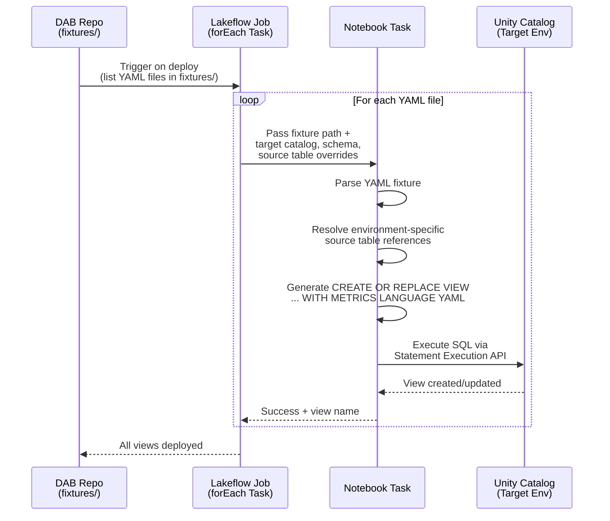

# 01 — Metric View Deployment Pipeline

> Referenced by: L100 § Metric View Deployment Pipeline

```mermaid
sequenceDiagram
    participant Repo as DAB Repo<br/>(fixtures/)
    participant Job as Lakeflow Job<br/>(forEach Task)
    participant NB as Notebook Task
    participant UC as Unity Catalog<br/>(Target Env)

    Repo->>Job: Trigger on deploy<br/>(list YAML files in fixtures/)
    loop For each YAML file
        Job->>NB: Pass fixture path +<br/>target catalog, schema,<br/>source table overrides
        NB->>NB: Parse YAML fixture
        NB->>NB: Resolve environment-specific<br/>source table references
        NB->>NB: Generate CREATE OR REPLACE VIEW<br/>... WITH METRICS LANGUAGE YAML
        NB->>UC: Execute SQL via<br/>Statement Execution API
        UC-->>NB: View created/updated
        NB-->>Job: Success + view name
    end
    Job-->>Repo: All views deployed
```
