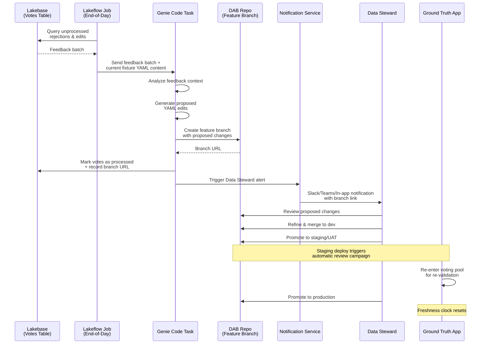

# 02 — Feedback Loop Pipeline

> Referenced by: L100 § Feedback Loop Pipeline

```mermaid
sequenceDiagram
    participant LB as Lakebase<br/>(Votes Table)
    participant LFJ as Lakeflow Job<br/>(End-of-Day)
    participant GC as Genie Code Task
    participant Git as DAB Repo<br/>(Feature Branch)
    participant Notif as Notification Service
    participant DS as Data Steward
    participant App as Ground Truth App

    LFJ->>LB: Query unprocessed<br/>rejections & edits
    LB-->>LFJ: Feedback batch
    LFJ->>GC: Send feedback batch +<br/>current fixture YAML content
    GC->>GC: Analyze feedback context
    GC->>GC: Generate proposed<br/>YAML edits
    GC->>Git: Create feature branch<br/>with proposed changes
    Git-->>GC: Branch URL
    GC->>LB: Mark votes as processed<br/>+ record branch URL
    GC->>Notif: Trigger Data Steward alert
    Notif->>DS: Slack/Teams/In-app notification<br/>with branch link

    DS->>Git: Review proposed changes
    DS->>Git: Refine & merge to dev
    DS->>Git: Promote to staging/UAT

    Note over App,Git: Staging deploy triggers<br/>automatic review campaign
    App->>App: Re-enter voting pool<br/>for re-validation

    DS->>Git: Promote to production
    Note over App: Freshness clock resets
```
