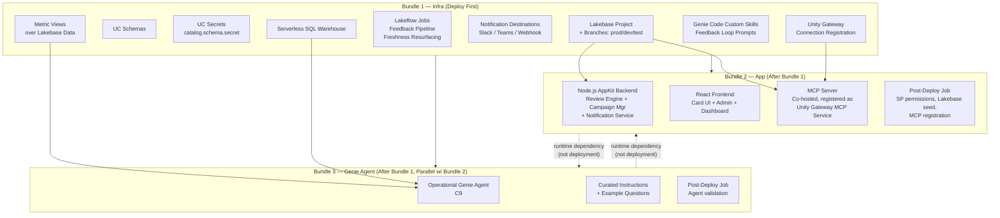

# 03 — Deployment Architecture (Three-Bundle DAB)

> Referenced by: L100 § Deployment Architecture

```mermaid
flowchart TB
    subgraph Bundle1["Bundle 1 — Infra (Deploy First)"]
        LB[Lakebase Project<br/>+ Branches: prod/dev/test]
        UC_Schema[UC Schemas]
        UC_Secrets[UC Secrets<br/>catalog.schema.secret]
        SQLWh[Serverless SQL Warehouse]
        LFJobs[Lakeflow Jobs<br/>Feedback Pipeline<br/>Freshness Resurfacing]
        NotifDest[Notification Destinations<br/>Slack / Teams / Webhook]
        UGConn[Unity Gateway<br/>Connection Registration]
        GCSkills[Genie Code Custom Skills<br/>Feedback Loop Prompts]
        MVOps[Metric Views<br/>over Lakebase Data]
    end

    subgraph Bundle2["Bundle 2 — App (After Bundle 1)"]
        AppKit[Node.js AppKit Backend<br/>Review Engine + Campaign Mgr<br/>+ Notification Service]
        ReactUI[React Frontend<br/>Card UI + Admin + Dashboard]
        MCPSrv[MCP Server<br/>Co-hosted, registered as<br/>Unity Gateway MCP Service]
        PostDeploy2[Post-Deploy Job<br/>SP permissions, Lakebase seed,<br/>MCP registration]
    end

    subgraph Bundle3["Bundle 3 — Genie Agent (After Bundle 1, Parallel w/ Bundle 2)"]
        GenieAgent[Operational Genie Agent<br/>C9]
        AgentInstr[Curated Instructions<br/>+ Example Questions]
        PostDeploy3[Post-Deploy Job<br/>Agent validation]
    end

    Bundle1 --> Bundle2
    Bundle1 --> Bundle3
    Bundle2 -. "runtime dependency<br/>(not deployment)" .-> Bundle3
    Bundle3 -. "runtime dependency<br/>(not deployment)" .-> Bundle2

    LB --> AppKit
    LB --> MCPSrv
    MVOps --> GenieAgent
    SQLWh --> GenieAgent
    UGConn --> MCPSrv
```
