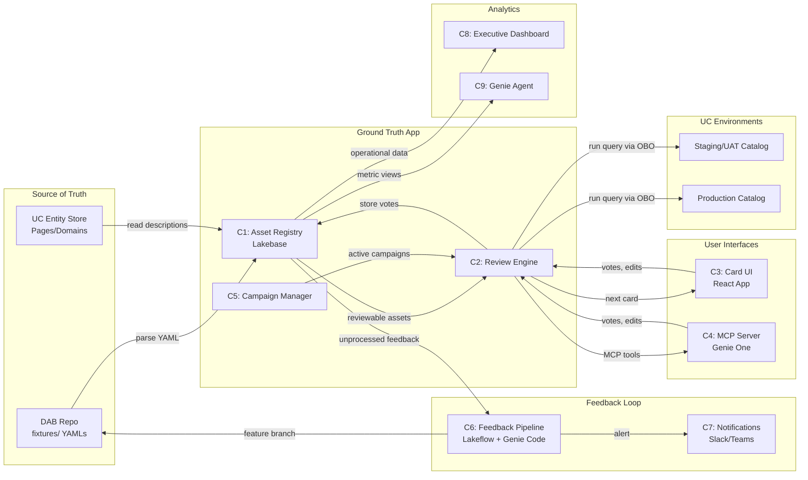

# 04 — End-to-End Data Flow

> Referenced by: L100 § Interface Contracts, § Data Flow

```mermaid
flowchart LR
    subgraph Sources["Source of Truth"]
        Fixtures[DAB Repo<br/>fixtures/ YAMLs]
        UCPages[UC Entity Store<br/>Pages/Domains]
    end

    subgraph AppLayer["Ground Truth App"]
        C1[C1: Asset Registry<br/>Lakebase]
        C2[C2: Review Engine]
        C5[C5: Campaign Manager]
    end

    subgraph Interfaces["User Interfaces"]
        C3[C3: Card UI<br/>React App]
        C4[C4: MCP Server<br/>Genie One]
    end

    subgraph Feedback["Feedback Loop"]
        C6[C6: Feedback Pipeline<br/>Lakeflow + Genie Code]
        C7[C7: Notifications<br/>Slack/Teams]
    end

    subgraph Analytics["Analytics"]
        C8[C8: Executive Dashboard]
        C9[C9: Genie Agent]
    end

    subgraph UCEnvs["UC Environments"]
        Staging[Staging/UAT Catalog]
        Prod[Production Catalog]
    end

    Fixtures -->|parse YAML| C1
    UCPages -->|read descriptions| C1
    C1 -->|reviewable assets| C2
    C5 -->|active campaigns| C2
    C2 -->|next card| C3
    C2 -->|MCP tools| C4
    C3 -->|votes, edits| C2
    C4 -->|votes, edits| C2
    C2 -->|store votes| C1
    C2 -->|run query via OBO| Staging
    C2 -->|run query via OBO| Prod
    C1 -->|unprocessed feedback| C6
    C6 -->|feature branch| Fixtures
    C6 -->|alert| C7
    C1 -->|operational data| C8
    C1 -->|metric views| C9
```
