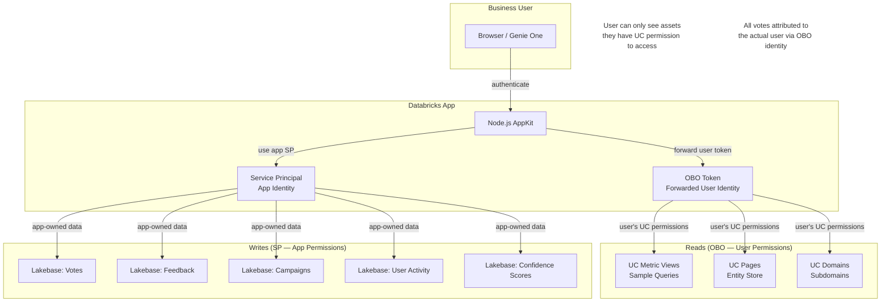

# 05 — Authentication Model (OBO + Service Principal)

> Referenced by: L100 § Cross-Cutting Patterns: Authentication & Authorization

```mermaid
flowchart TB
    subgraph User["Business User"]
        Browser[Browser / Genie One]
    end

    subgraph App["Databricks App"]
        AppKit[Node.js AppKit]
        OBO_Token[OBO Token<br/>Forwarded User Identity]
        SP_Token[Service Principal<br/>App Identity]
    end

    subgraph Reads["Reads (OBO — User Permissions)"]
        UC_MV[UC Metric Views<br/>Sample Queries]
        UC_Pages[UC Pages<br/>Entity Store]
        UC_Domains[UC Domains<br/>Subdomains]
    end

    subgraph Writes["Writes (SP — App Permissions)"]
        LB_Votes[Lakebase: Votes]
        LB_Feedback[Lakebase: Feedback]
        LB_Campaigns[Lakebase: Campaigns]
        LB_Gamification[Lakebase: User Activity]
        LB_Scores[Lakebase: Confidence Scores]
    end

    Browser -->|authenticate| AppKit
    AppKit -->|forward user token| OBO_Token
    AppKit -->|use app SP| SP_Token

    OBO_Token -->|user's UC permissions| UC_MV
    OBO_Token -->|user's UC permissions| UC_Pages
    OBO_Token -->|user's UC permissions| UC_Domains

    SP_Token -->|app-owned data| LB_Votes
    SP_Token -->|app-owned data| LB_Feedback
    SP_Token -->|app-owned data| LB_Campaigns
    SP_Token -->|app-owned data| LB_Gamification
    SP_Token -->|app-owned data| LB_Scores

    Note1[User can only see assets<br/>they have UC permission to access]
    Note2[All votes attributed to<br/>the actual user via OBO identity]

    style Note1 fill:none,stroke:none
    style Note2 fill:none,stroke:none
```
