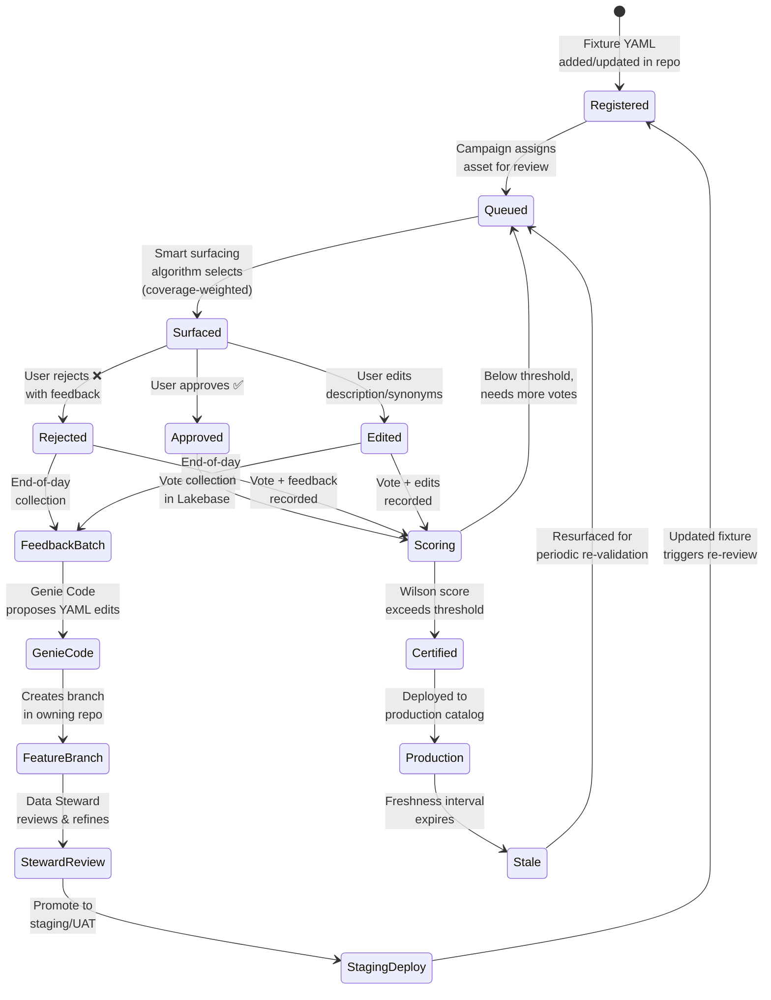

# 06 — Card Lifecycle (Asset → Surfacing → Review → Feedback → Re-deploy)

> Referenced by: L100 § Smart Surfacing Algorithm, § Card Lifecycle

```mermaid
stateDiagram-v2
    [*] --> Registered: Fixture YAML<br/>added/updated in repo

    Registered --> Queued: Campaign assigns<br/>asset for review

    Queued --> Surfaced: Smart surfacing<br/>algorithm selects<br/>(coverage-weighted)

    Surfaced --> Approved: User approves ✅
    Surfaced --> Rejected: User rejects ❌<br/>with feedback
    Surfaced --> Edited: User edits<br/>description/synonyms

    Approved --> Scoring: Vote recorded<br/>in Lakebase
    Rejected --> Scoring: Vote + feedback<br/>recorded
    Edited --> Scoring: Vote + edits<br/>recorded

    Scoring --> Certified: Wilson score<br/>exceeds threshold
    Scoring --> Queued: Below threshold,<br/>needs more votes

    Rejected --> FeedbackBatch: End-of-day<br/>collection
    Edited --> FeedbackBatch: End-of-day<br/>collection

    FeedbackBatch --> GenieCode: Genie Code<br/>proposes YAML edits
    GenieCode --> FeatureBranch: Creates branch<br/>in owning repo
    FeatureBranch --> StewardReview: Data Steward<br/>reviews & refines
    StewardReview --> StagingDeploy: Promote to<br/>staging/UAT
    StagingDeploy --> Registered: Updated fixture<br/>triggers re-review

    Certified --> Production: Deployed to<br/>production catalog
    Production --> Stale: Freshness interval<br/>expires
    Stale --> Queued: Resurfaced for<br/>periodic re-validation
```
