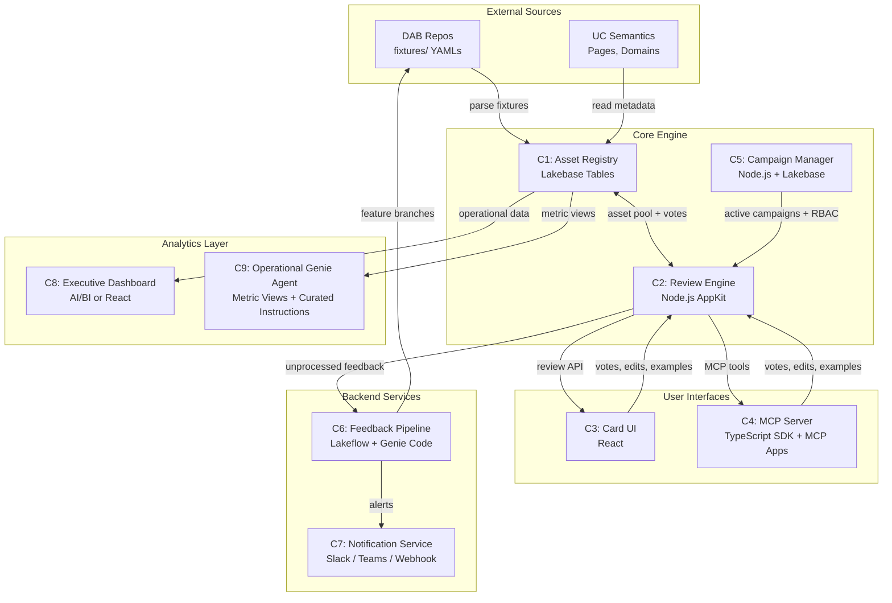

# 07 — Component Topology (System Map)

> Referenced by: L100 § Component Inventory — the "map" of how C1–C9 connect

```mermaid
flowchart TB
    subgraph ExternalSources["External Sources"]
        DABRepos[DAB Repos<br/>fixtures/ YAMLs]
        UCSemantics[UC Semantics<br/>Pages, Domains]
    end

    subgraph CoreEngine["Core Engine"]
        C1[C1: Asset Registry<br/>Lakebase Tables]
        C2[C2: Review Engine<br/>Node.js AppKit]
        C5[C5: Campaign Manager<br/>Node.js + Lakebase]
    end

    subgraph UserInterfaces["User Interfaces"]
        C3[C3: Card UI<br/>React]
        C4[C4: MCP Server<br/>TypeScript SDK + MCP Apps]
    end

    subgraph BackendServices["Backend Services"]
        C6[C6: Feedback Pipeline<br/>Lakeflow + Genie Code]
        C7[C7: Notification Service<br/>Slack / Teams / Webhook]
    end

    subgraph AnalyticsLayer["Analytics Layer"]
        C8[C8: Executive Dashboard<br/>AI/BI or React]
        C9[C9: Operational Genie Agent<br/>Metric Views + Curated Instructions]
    end

    DABRepos -->|parse fixtures| C1
    UCSemantics -->|read metadata| C1

    C1 <-->|asset pool + votes| C2
    C5 -->|active campaigns + RBAC| C2

    C2 -->|review API| C3
    C2 -->|MCP tools| C4
    C3 -->|votes, edits, examples| C2
    C4 -->|votes, edits, examples| C2

    C2 -->|unprocessed feedback| C6
    C6 -->|feature branches| DABRepos
    C6 -->|alerts| C7

    C1 -->|operational data| C8
    C1 -->|metric views| C9
```
