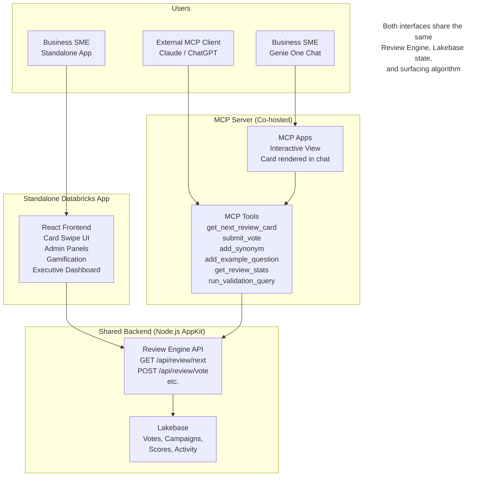

# 08 — Dual Interface Architecture

> Referenced by: L100 § Dual Interface Architecture

```mermaid
flowchart TB
    subgraph Users["Users"]
        BizUser1[Business SME<br/>Standalone App]
        BizUser2[Business SME<br/>Genie One Chat]
        ExtClient[External MCP Client<br/>Claude / ChatGPT]
    end

    subgraph StandaloneApp["Standalone Databricks App"]
        ReactApp[React Frontend<br/>Card Swipe UI<br/>Admin Panels<br/>Gamification<br/>Executive Dashboard]
    end

    subgraph MCPInterface["MCP Server (Co-hosted)"]
        MCPTools[MCP Tools<br/>get_next_review_card<br/>submit_vote<br/>add_synonym<br/>add_example_question<br/>get_review_stats<br/>run_validation_query]
        MCPAppsView[MCP Apps<br/>Interactive View<br/>Card rendered in chat]
    end

    subgraph SharedBackend["Shared Backend (Node.js AppKit)"]
        ReviewAPI[Review Engine API<br/>GET /api/review/next<br/>POST /api/review/vote<br/>etc.]
        Lakebase[Lakebase<br/>Votes, Campaigns,<br/>Scores, Activity]
    end

    BizUser1 --> ReactApp
    BizUser2 --> MCPAppsView
    ExtClient --> MCPTools

    ReactApp --> ReviewAPI
    MCPTools --> ReviewAPI
    MCPAppsView --> MCPTools

    ReviewAPI --> Lakebase

    Note1[Both interfaces share the same<br/>Review Engine, Lakebase state,<br/>and surfacing algorithm]
    style Note1 fill:none,stroke:none
```
