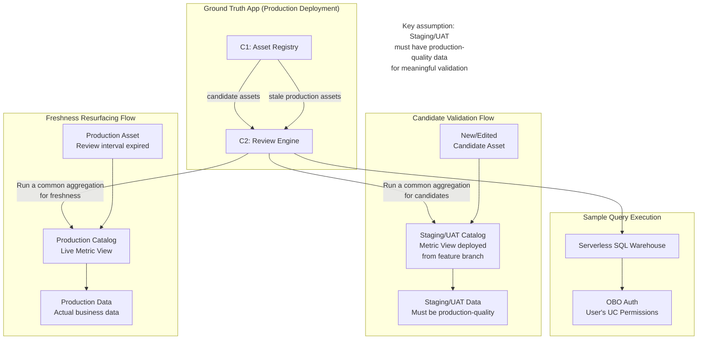

# 09 — Multi-Environment Read Pattern

> Referenced by: L100 § Multi-Environment Architecture

```mermaid
flowchart TB
    subgraph App["Ground Truth App (Production Deployment)"]
        ReviewEngine[C2: Review Engine]
        AssetRegistry[C1: Asset Registry]
    end

    subgraph Candidates["Candidate Validation Flow"]
        direction LR
        NewAsset[New/Edited<br/>Candidate Asset]
        StagingMV[Staging/UAT Catalog<br/>Metric View deployed<br/>from feature branch]
        StagingData[Staging/UAT Data<br/>Must be production-quality]
    end

    subgraph Freshness["Freshness Resurfacing Flow"]
        direction LR
        StaleAsset[Production Asset<br/>Review interval expired]
        ProdMV[Production Catalog<br/>Live Metric View]
        ProdData[Production Data<br/>Actual business data]
    end

    subgraph QueryExec["Sample Query Execution"]
        SQLWh[Serverless SQL Warehouse]
        OBOAuth[OBO Auth<br/>User's UC Permissions]
    end

    AssetRegistry -->|candidate assets| ReviewEngine
    ReviewEngine -->|"Run a common aggregation"<br/>for candidates| StagingMV
    StagingMV --> StagingData
    NewAsset --> StagingMV

    AssetRegistry -->|stale production assets| ReviewEngine
    ReviewEngine -->|"Run a common aggregation"<br/>for freshness| ProdMV
    ProdMV --> ProdData
    StaleAsset --> ProdMV

    ReviewEngine --> SQLWh
    SQLWh --> OBOAuth

    Note1[Key assumption: Staging/UAT<br/>must have production-quality data<br/>for meaningful validation]
    style Note1 fill:none,stroke:none
```
