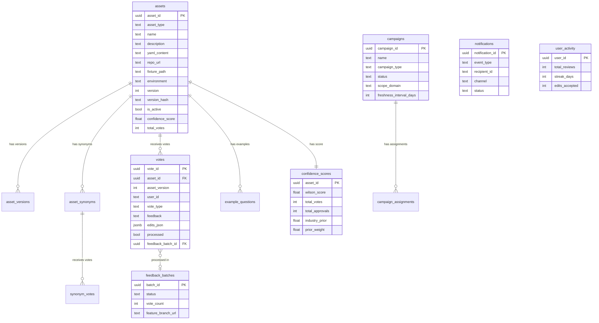

# 10 — Lakebase ER Diagram (Asset Registry)

> Referenced by: L200-C1 § Lakebase Schema

```mermaid
erDiagram
    assets ||--o{ asset_versions : "has versions"
    assets ||--o{ asset_synonyms : "has synonyms"
    assets ||--o{ votes : "receives votes"
    assets ||--o{ example_questions : "has examples"
    assets ||--|| confidence_scores : "has score"
    
    asset_synonyms ||--o{ synonym_votes : "receives votes"
    
    votes }o--o| feedback_batches : "processed in"
    
    campaigns ||--o{ campaign_assignments : "has assignments"
    
    assets {
        uuid asset_id PK
        text asset_type
        text name
        text description
        text yaml_content
        text repo_url
        text fixture_path
        text environment
        int version
        text version_hash
        bool is_active
        float confidence_score
        int total_votes
    }
    
    votes {
        uuid vote_id PK
        uuid asset_id FK
        int asset_version
        text user_id
        text vote_type
        text feedback
        jsonb edits_json
        bool processed
        uuid feedback_batch_id FK
    }
    
    confidence_scores {
        uuid asset_id PK
        float wilson_score
        int total_votes
        int total_approvals
        float industry_prior
        float prior_weight
    }
    
    campaigns {
        uuid campaign_id PK
        text name
        text campaign_type
        text status
        text scope_domain
        int freshness_interval_days
    }
    
    feedback_batches {
        uuid batch_id PK
        text status
        int vote_count
        text feature_branch_url
    }
    
    notifications {
        uuid notification_id PK
        text event_type
        text recipient_id
        text channel
        text status
    }
    
    user_activity {
        uuid user_id PK
        int total_reviews
        int streak_days
        int edits_accepted
    }
```
