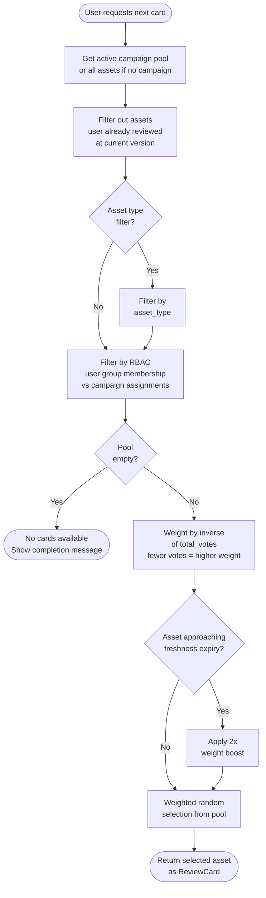

# 11 — Smart Surfacing Algorithm (Review Engine)

> Referenced by: L200-C2 § Smart Surfacing Algorithm

```mermaid
flowchart TD
    Start([User requests next card]) --> GetPool[Get active campaign pool<br/>or all assets if no campaign]
    GetPool --> FilterReviewed[Filter out assets<br/>user already reviewed<br/>at current version]
    FilterReviewed --> FilterType{Asset type<br/>filter?}
    FilterType -->|Yes| ApplyType[Filter by<br/>asset_type]
    FilterType -->|No| CheckRBAC
    ApplyType --> CheckRBAC[Filter by RBAC<br/>user group membership<br/>vs campaign assignments]
    CheckRBAC --> EmptyCheck{Pool<br/>empty?}
    EmptyCheck -->|Yes| NoCards([No cards available<br/>Show completion message])
    EmptyCheck -->|No| WeightCoverage[Weight by inverse<br/>of total_votes<br/>fewer votes = higher weight]
    WeightCoverage --> FreshnessBoost{Asset approaching<br/>freshness expiry?}
    FreshnessBoost -->|Yes| Apply2x[Apply 2x<br/>weight boost]
    FreshnessBoost -->|No| WeightedSelect
    Apply2x --> WeightedSelect[Weighted random<br/>selection from pool]
    WeightedSelect --> ReturnCard([Return selected asset<br/>as ReviewCard])
```
