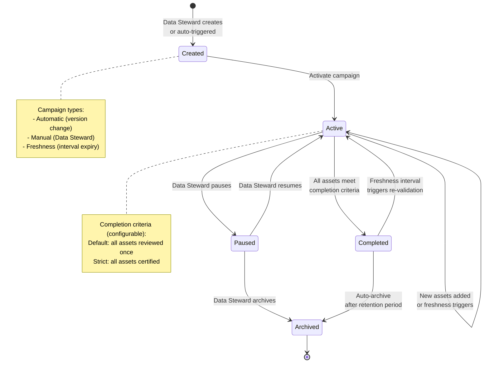

# 12 — Campaign Lifecycle (Campaign Manager)

> Referenced by: L200-C5 § Campaign Lifecycle

```mermaid
stateDiagram-v2
    [*] --> Created: Data Steward creates<br/>or auto-triggered

    Created --> Active: Activate campaign

    Active --> Completed: All assets meet<br/>completion criteria
    Active --> Paused: Data Steward pauses
    Active --> Active: New assets added<br/>or freshness triggers

    Paused --> Active: Data Steward resumes
    Paused --> Archived: Data Steward archives

    Completed --> Archived: Auto-archive<br/>after retention period
    Completed --> Active: Freshness interval<br/>triggers re-validation

    Archived --> [*]

    note right of Created
        Campaign types:
        - Automatic (version change)
        - Manual (Data Steward)
        - Freshness (interval expiry)
    end note

    note right of Active
        Completion criteria (configurable):
        Default: all assets reviewed once
        Strict: all assets certified
    end note
```
