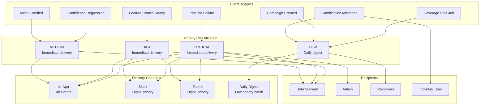

# 13 — Notification Routing (Notification Service)

> Referenced by: L200-C7 § Notification Types

```mermaid
flowchart TB
    subgraph Triggers["Event Triggers"]
        FBReady[Feature Branch Ready]
        PipeFail[Pipeline Failure]
        ScoreReg[Confidence Regression]
        CovStall[Coverage Stall 48h]
        CampNew[Campaign Created]
        Certified[Asset Certified]
        GameMile[Gamification Milestone]
    end

    subgraph Priority["Priority Classification"]
        Critical[CRITICAL<br/>Immediate delivery]
        High[HIGH<br/>Immediate delivery]
        Medium[MEDIUM<br/>Immediate delivery]
        Low[LOW<br/>Daily digest]
    end

    subgraph Channels["Delivery Channels"]
        InApp[In-App<br/>All events]
        Slack[Slack<br/>High+ priority]
        Teams[Teams<br/>High+ priority]
        Digest[Daily Digest<br/>Low priority batch]
    end

    subgraph Recipients["Recipients"]
        DS[Data Steward]
        Admin[Admin]
        Reviewers[Reviewers]
        Individual[Individual User]
    end

    FBReady --> High
    PipeFail --> Critical
    ScoreReg --> Medium
    CovStall --> Low
    CampNew --> Low
    Certified --> Medium
    GameMile --> Low

    Critical --> InApp & Slack & Teams
    High --> InApp & Slack & Teams
    Medium --> InApp
    Low --> Digest

    High --> DS
    Critical --> DS & Admin
    Medium --> DS
    Low --> Reviewers
    GameMile --> Individual
```
